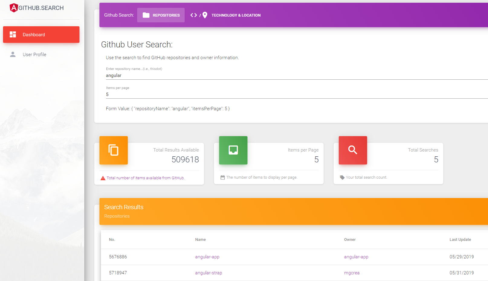

# Angular for .NET Developers

A discussion about Angular for .NET developers. There are many transferable skills that make .NET developers excellent Angular developers. What is it that makes your skills unique and desirable for an Angular team?

> Sample Angular Application: The [GitHub repository](https://github.com/buildmotion/github-search) contains the source code for the an application that demonstrates some of the patterns, layers, and project structure that will be familiar to .NET developers. View online: https://github-search-api-with-angular.firebaseapp.com




The sample application demonstrates the following:

* a solution-based approach using Angular Workspace
* using shared library projects
  * cross-cutting concern libraries
  * application feature libraries
  * framework libraries (i.e., rule engine)
  * utility libraries (HTTP/API access)
* a solution with multiple application projects (Single-page Application)
* service and business logic layers
* reactive programming using Rxjs

## TypeScript
    
* Microsoft
  * Anders Hejlsberg, Erich Gamma, Steve Lucco
  * Who is Michael Collins?
* Static Typing
  * static language analysis (tooling/IDE)
* Annotations (Decorators)
* Class-based Programming
  * classes, abstract classes
  * interfaces
  * enums
* Object-Oriented Programming
  * Encapsulation
  * Inheritance
  * Abstraction
  * Polymorphism
* Collections
  * IEnumerable/IIterator
  * Observable/Observer
* Generics
* Support in multiple IDEs
* Adoption in Other JavaScript Frameworks
  * React, Vue
* Server-Side
  * NestJS
  * NodeJS
* Libraries
  * package and publish

## Visual Studio/Code

* Has the name *Visual Studio*
* Included in VS since 2013
* Package Management
  * npm/nuget

## Angular Anatomy

* Modules
* Components
* Services
* Dependency Injection

## Angular Development Environment

* Monorepo --> Solution
  * Many projects (applications, libraries, schematics)
* Scaffolding (Angular CLI)
  * projects, applications, libraries, schematics
  * modules, services, components, directives, pipes
* Terminal
  * scaffold
  * build, test, lint
  * serve
* Unit and Integration Test Support

### CLI Commands

Create a new workspace (solution).

```ts
create-nx-workspace workspace --create-application --npm-scope=denver --style=scss --dry-run
```

Create a new application project in the workspace.

```ts
ng generate application webOne --framework=angular --style=scss --unit-test-runner=jest --e2e-test-runner=cypress  --routing
```

Add a module (think assembly/library) that is internal to the application. A container for related things (services, components, models, etc.).

```ts
ng generate module products --project=web-one
```

Add a new component to the `ProductsModule`.

```ts
ng generate component products/productList --project=web-one
```

Add a service to the module to provide an API for the `ProductsModule`. 

```ts
ng generate service products/ products --project=web-one
```

Create a new library project that can be shared with all applications and/or any other library projects.

```ts
ng generate library logging
```

Add a service to the logging module. Creates API end-points for the `Logging` library.

```ts
ng generate service logging --project=logging
```

Build your web application.

```ts
ng build web-one
```

Serve the application to view in browser.

```ts
ng serve web-one
```

## Design Patterns

* Composite
* Template Method
* Facade
* *Any design pattern, really!*

## Architecture

* n-tier
* service APIs
* Component/Controller
  * MVC

## Contact Information

Matt Vaughn
* web: https://angularlicio.us
  * podcast
  * blog
  * resources
* email: matt@angularlicio.us
* twitter: @angularlicious
* [Angularlicious YouTube Channel](https://www.youtube.com/channel/UCl8tAy4LmasTArFYnGrtkBg)

## Resources

### TypeScript Resources
* [Who built Microsoft TypeScript and why](https://www.zdnet.com/article/who-built-microsoft-typescript-and-why/)
  * [The First TypeScript Demo](https://hackernoon.com/the-first-typescript-demo-905ea095a70f)
* [Typescript History](https://en.wikipedia.org/wiki/TypeScript)
* [Typescript Official](http://www.typescriptlang.org/)
* [Anders Hejlsberg](https://en.wikipedia.org/wiki/Anders_Hejlsberg)
* [Typescript Documentation](http://www.typescriptlang.org/docs/home.html)
* [Typescript Tutorials](http://www.typescriptlang.org/docs/handbook/typescript-in-5-minutes.html)

### Angular Resources

#### Online
* [Angular.io](https://angular.io)
* [Angular.io :: Getting Started](https://angular.io/start)
* [Flipboard: Angularlicio.us On Like Donkey Ko(ng)](https://flipboard.com/@mattvaughn/angularlicio.us-%3A%3A-angular-on-like-donkey-(ko)ng-8b0apofoy)
* [Rangle.io :: Learning Resources](https://archive.rangle.io/resources/tags/angular/)

#### Courses
* [Angular by Asim Hussain](https://codecraft.tv/courses/angular/)
* [Angular from Theory to Practice](https://codecraft.tv/assets/books/angular-from-theory-to-practice.pdf)
* [FreeCodeCamp.org: Free 33-part Course by Dan Wahlin](https://www.freecodecamp.org/news/want-to-learn-angular-heres-our-free-33-part-course-by-dan-wahlin-fc2ff27ab451/)
* [Angular Fundamentals by Microsoft](https://www.edx.org/course/angular-fundamentals-3)

#### Books
* [Rangle.io: Angular 2 Training Book](https://sathyalog.files.wordpress.com/2017/01/ngcourse2.pdf)
* [Angular Succinctly (free)](https://www.syncfusion.com/ebooks/angular-succinctly)

#### Meetups
* [Meetup: Rocky Mountain Angular](https://www.meetup.com/RockyMountainAngular/)
* [Meetup: Angular Boulder](https://www.meetup.com/angular-boulder/)

#### Blogs

* [Advanced https://blog.angularindepth.com/](https://blog.angularindepth.com/)

#### Rxjs

* [Reactive Extensions](https://docs.microsoft.com/en-us/previous-versions/dotnet/reactive-extensions/hh242985(v=vs.103))
  * Overview and historical information
  * Reactive Extensions for .NET
* [Introduction to Reactive Programming you've been missing" by Andre Staltz](https://gist.github.com/staltz/868e7e9bc2a7b8c1f754)
* [Angular.io Rxjs](https://angular.io/guide/rx-library)
* [Rx Observable](http://reactivex.io/documentation/observable.html)
* [Dozens of Rxjs Resources](http://reactivex.io/tutorials.html)
* [Rxjs Resources](https://rxjs-dev.firebaseapp.com/resources)
